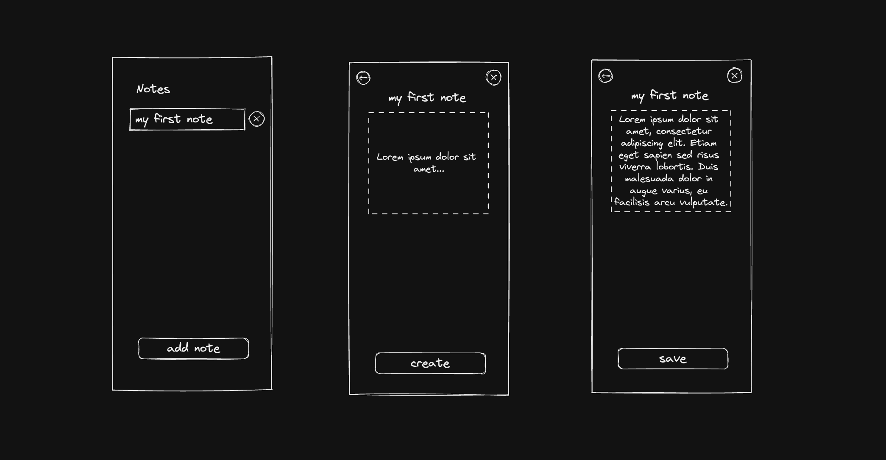

# Mobile Journey

### Introduction

This repository contains the code of 4 mobile apps created using 4 different technologies. The goal here is to develop a simple CRUD app using the same API and learn about the different technologies used. 

### Technologies

- React Native (Javascript multiplatform)
- Flutter (Dart multiplatform)
- Swift UI (native iOS)
- Jetpack Compose (native Android)

### Quick sketch

